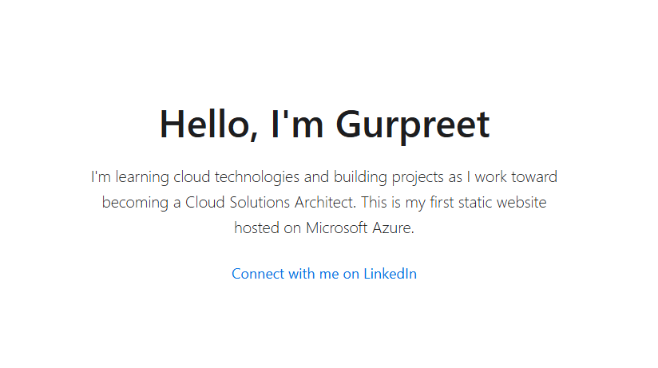

# 🚀 My First Static Website Hosted on Azure

This is a simple static website I created and deployed using **Azure Blob Storage** as part of my journey to become a Cloud Solutions Architect.

## 🧠 What I Learned

I learned how to create and configure a Storage Account in Azure  
I enabled static website hosting using Blob Storage  
I uploaded and managed files in the Azure Portal  
I understood what endpoints are and how to access the live site

## 🔧 What's Inside

`index.html` — basic webpage built with HTML and a bit of styling  
Hosted on Azure with a live URL anyone can access

## 🌐 Live Website

🔗 [View the live site here](https://gurpreetstatic123.z33.web.core.windows.net/)

## 📌 Why I Built This

I wanted hands-on experience with cloud services and to show I can deploy something real. This is my first step into building real-world cloud projects.

## 👋 About Me

I currently work in tech support and I'm learning cloud on the side. My goal is to move into a cloud engineering or solutions architect role.

Connect with me on [LinkedIn](https://www.linkedin.com/in/gurpreet-singh-0b6568238/)

Built with focus and ambition by Gurpreet Singh
